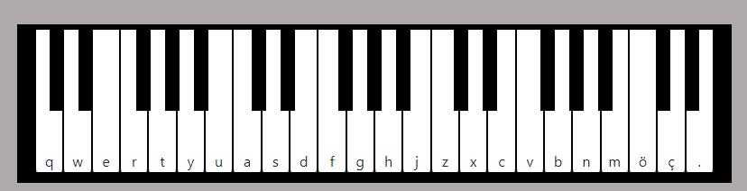

# Basit Piyano Çalışması 



---
Bu repoda js / jquery vs css kullanarak basit bir piyano app yapmaya çalıştım.


### Kaynaklar

- Kodlarından yardım aldığım proje
https://github.com/wesbos/JavaScript30/tree/master/01%20-%20JavaScript%20Drum%20Kit

- Notaları indirdiğim site
https://archive.org/details/24-piano-keys/key17.mp3

- Piyano ile ilgili temel bilgiler
https://www.kolaynota.com/melodika-nota-yerleri/#google_vignette

### Öğrendiğim yeni bilgiler

- data-* attribute kullanımı ile veri saklamak istediğimiz etiketi; data-veriadı=”saklanacak veri”; şeklinde tanımlarız. Ben ses dosyası sakladığım için her keyDown event oluştuğunda e.key içine gelen harfe göre tanımlı bir ses dosyası .play() fonksiyonu ile çalıştırıldı.

 - ```currentTime = 0``` script i ses dosyası çalıştıktan sonra varsayılan zamanı ayarlamamızı sağlar. 0' a eşitlediğim için aynı notaya tekrar bastığımda sessin çalma süresinin bitmesini beklemeden tekrar çalabiliyor. 
 
 - ```play()``` function ses dosyalarını oynatmak için kullanılır.